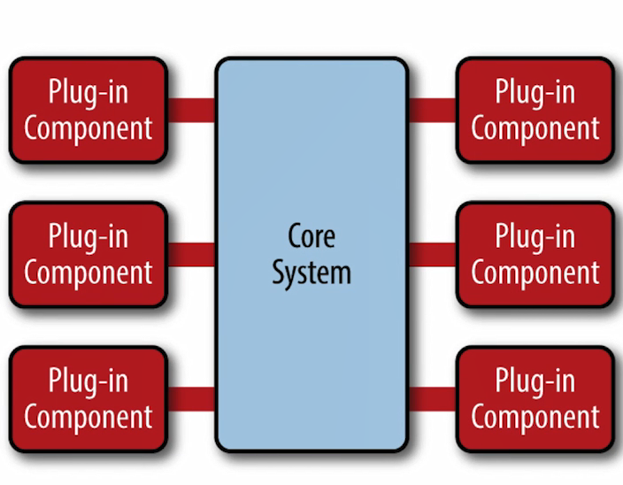
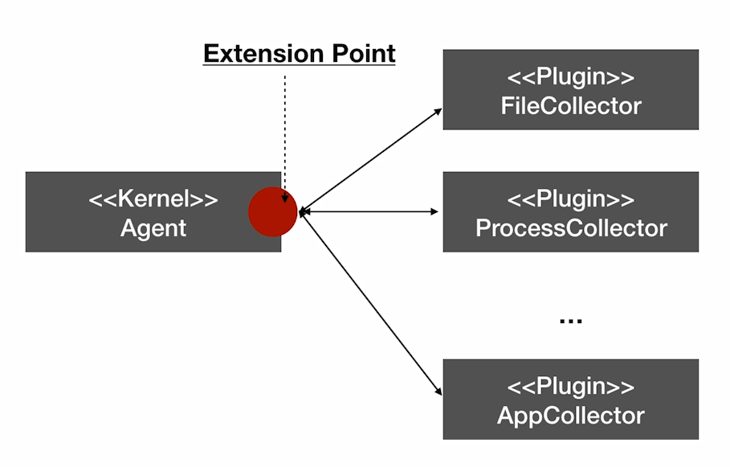

# 架构模式
An architectural pattern is a general, reusable solution to a commonly occurring problem in software architecture within a given context.

## Pipe-Filter

### 架构

### 模式
* 非常适合与数据处理及数据分析系统
* Filter 封装数据处理的功能
* 松耦合：Filter只跟数据（格式）耦合
* Pipe 用于连接Filter 传递数据或者在异步处理过程中缓冲数据流  
*进程内同步调用时，pipe演变为数据在方法调用间传递*  

### Filter 和 组合模式


### 示例  
```$go
```
---

## Micro Kernel

### 特点/要点  

1. 特点
    * 易于扩展
    * 错误隔离
    * 保持架构一致性
2. 要点
    * 内核包含公共流程或通用逻辑
    * 将可变或可扩展部分规划为扩展点
    * 抽象扩展点行为，定义接口
    * 利用插件进行扩展

### 示例

